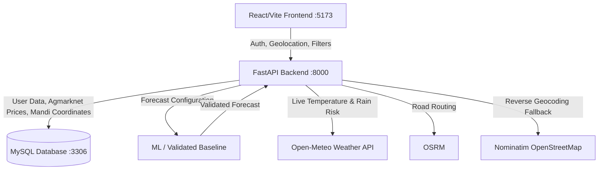

# 🌾 MandiMitra — Full Stack Integration & Developer Guide

MandiMitra is a farmer-focused crop selling decision-support platform connecting **React/Vite Frontend** $\longleftrightarrow$ **FastAPI Backend** $\longleftrightarrow$ **MySQL Database** $\longleftrightarrow$ **MandiMitra-ML Models**.

---

## 🚀 Quickstart Guide

### 1. Prerequisites
- **Node.js** v18+ & `npm`
- **Python** 3.10+ (tested on Python 3.14)
- **MySQL** 8.0+ running on `localhost:3306`

### 2. MySQL Database Setup
```bash
# Log in to MySQL and create database
mysql -u root -p -e "CREATE DATABASE IF NOT EXISTS mandimitra;"

# Apply schema
mysql -u root -p mandimitra < backend/schema.sql

# Ingest Agmarknet data & geocoded mandis (283 mandis, 31,270 records)
backend/venv/bin/python backend/scripts/seed_db.py
```

### 3. Backend Setup & Run (FastAPI)
```bash
# Navigate to backend, create virtual environment and install dependencies
cd backend
python3 -m venv venv
source venv/bin/activate
pip install -r requirements.txt

# Configure backend environment variables
cp .env.example .env
# Edit .env with your MySQL DB_PASSWORD and JWT_SECRET_KEY

# Start backend server on port 8000
uvicorn app.main:app --host 0.0.0.0 --port 8000 --reload
```
API Documentation will be live at: [http://localhost:8000/docs](http://localhost:8000/docs)

### 4. Frontend Setup & Run (Vite / React)
```bash
# Navigate to frontend and install dependencies
cd frontend
npm install

# Start Vite development server on port 5173
npm run dev
```
Frontend will be accessible at: [http://localhost:5173](http://localhost:5173)

### 5. Automated E2E Verification Test Suite
```bash
# From repository root or backend directory:
PYTHONPATH=backend python3 -m unittest backend/tests/test_full_stack_e2e.py
```

---


---

## 🏛️ Current Validated Architecture

MandiMitra uses a hybrid decision-support architecture:

1. Retrieve current mandi data.
2. Validate market/data coverage.
3. Select the crop's configured forecasting method.
4. Check historical-data sufficiency.
5. Run ML only when the configured and validated conditions are satisfied.
6. Reject invalid/OOD ML outputs.
7. Fall back to a validated baseline when required.
8. Calculate road distance.
9. Calculate transport cost.
10. Calculate gross/net return.
11. Compare present vs expected future economics.
12. Produce the farmer-facing recommendation.

This is the current production architecture.

### Validated Hybrid Forecasting Architecture

MandiMitra does NOT assume that an ML model should be used for every prediction. Forecasting is governed by crop configuration, trained-market coverage, historical-data sufficiency, input validity, out-of-distribution checks, model availability, and validated fallback methods.

The production decision flow is:

```text
                    Forecast Request
                          │
                          ▼
                 Check crop configuration
                          │
                          ▼
              forecast_method_config.json
                          │
              ┌───────────┴───────────┐
              │                       │
       Valid configured ML      Persistence /
              │                 validated baseline
              ▼                       │
      Validate market                 │
      + history + data                │
              │                       │
       ┌──────┴──────┐                │
       │             │                │
     Valid         Invalid             │
       │             │                │
       ▼             ▼                ▼
      ML          Fallback       Baseline result
       │             │                │
       └─────────────┴────────────────┘
                     │
                     ▼
             Final validated forecast
```

`forecast_method_config.json` serves as the production source of truth for selecting the forecasting method. ML artifacts may exist even when production configuration selects a baseline. Runtime must respect the configured forecasting method, and the method should be surfaced truthfully to the frontend.

**Current validated configuration:**
- **Rice:** Persistence
- **Wheat:** Chronos-2 (configured/available, active only if supported by implementation)

### Forecasting Safety & Fallback

MandiMitra deliberately avoids generating an ML prediction when the required conditions are not satisfied. Fallback can occur when:
- the mandi was not part of the model's validated training coverage
- insufficient historical observations exist
- the model artifact is unavailable
- input data is invalid
- the raw model prediction fails validation/OOD checks

When a valid current price exists, the system prefers a validated baseline rather than showing an unreliable ML prediction. When no usable price exists, the forecast is reported as unavailable. This is intentional system behavior, not an error.

### Insufficient Historical Data

The forecasting pipeline requires sufficient historical observations before attempting feature-based ML inference. The current validated minimum is **31 usable historical rows**. 

If fewer than 31 usable observations are available:
- ML is not executed.
- The system does not fabricate historical rows, zero-pad missing history, or invent prices.
- A validated persistence/recent-price fallback is used when a valid current price exists.
- The UI/API communicates that limited historical data prevented ML forecasting.

### Out-of-Distribution Prediction Protection

The system validates raw ML predictions before exposing them as the final forecast. If an ML prediction is considered invalid or materially outside the validated input/data behavior, the raw prediction is rejected (NOT silently clamped to an arbitrary percentage). A validated fallback is used when possible, and the forecast method/status remains truthful.

### Backend as Economic Source of Truth

The backend is authoritative for:
- distance
- billable distance
- transport cost
- gross value
- net value
- final validated forecast used for recommendation

The frontend may perform display-level enrichment/calculation where required by the existing implementation, but it must remain synchronized with backend values and must not contradict authoritative results.

## 🏛️ System Architecture



### Core Features Implemented:
1. **Farmer Authentication**: Argon2id password hashing + JWT tokens with profile persistence in MySQL.
2. **Crop Selection**: Supports Wheat, Rice, Tomato, and Cotton.
3. **KG to Quintal Auto-Conversion**: 1 Quintal = 100 KG.
4. **Middleman Option**: Net payout comparison deducting commission and fees.
5. **500 KM Mandi Discovery**: Backend filters mandis using road distance where available within a 500 km radius.
6. **Transparent Transportation Deduction**: Backend-authoritative ₹10/km one-way deduction using integer billable-kilometre calculation.
7. **Best Option Badge**: Mandi with the highest net value is prominently highlighted (`⭐ BEST OPTION`).
8. **2–3 Day Price Forecasting**: A zero-leakage 40-feature forecasting pipeline with crop-specific production methods, trained-market validation, insufficient-data fallbacks, and OOD prediction safeguards.
9. **Decision Recommendation Engine**: `SELL TODAY` vs `HOLD FOR 2–3 DAYS` comparison factoring the final validated future price, holding costs, and contextual weather information.
10. **Recent Searches**: Persisted in MySQL and reloadable with a single click.

---

# Original Functional & Design Specifications

## 1. Project Overview

MandiMitra is a farmer-focused crop selling decision-support platform.

The main purpose is to help a farmer answer:

> "Where should I sell my crop, and should I sell today or wait 2–3 days?"

The platform combines:

- Current mandi prices
- Historical mandi prices
- ML-based 2–3 day price prediction
- Sell Today / Hold recommendation
- Mandi comparison
- Farmer location
- Automatic mandi distance calculation
- Transportation cost
- Middleman comparison
- Weather information and alerts
- Recent searches

The farmer may not be comfortable using complex websites.

Therefore, the UI must be:
- Very simple
- Visual
- Guided
- Mobile friendly
- Easy to understand
- Minimal in navigation

Do not create a complicated analytics dashboard.

---

# 2. Supported Crops

MandiMitra currently supports ONLY:

1. Wheat
2. Rice
3. Tomato
4. Cotton

Use these four crops throughout the application.

Use friendly cartoon/illustrated images for all four crops.

---

# 3. Main Farmer Flow

The primary farmer journey should be:

Select Crop
↓
Enter Quantity
↓
Confirm Location
↓
Middleman? Yes / No
↓
Enter Middleman Details if applicable
↓
Find All Mandis Within 500 KM
↓
Get Current Mandi Prices
↓
Calculate Distance
↓
Calculate Transportation Cost
↓
Calculate Net Return
↓
Compare Mandis
↓
Compare Middleman if applicable
↓
Show Historical Price Trend
↓
Show 2–3 Day Price Prediction
↓
Show Final SELL TODAY / HOLD recommendation

The farmer should not need to manually perform calculations.

---

# 4. Step 1 — Select Crop

Show:

## What crop do you want to sell?

Display four large visual cards:

🌾 Wheat
🍚 Rice
🍅 Tomato
🌿 Cotton

Each card should use an appropriate cartoon/agricultural illustration.

The farmer should be able to select one crop.

Do not show additional crops.

---

# 5. Step 2 — Enter Quantity

After crop selection:

## How much do you want to sell?

Allow the farmer to enter the quantity in:

KG

Example:

500 KG

The farmer should NOT have to convert kilograms to quintals.

The system handles the conversion.

Conversion:

1 Quintal = 100 KG

Formula:

quantity_quintal = quantity_kg / 100

Example:

500 KG = 5 Quintals

The entered quantity is then used to calculate the value at every mandi.

---

# 6. Step 3 — Farmer Location

The farmer's location should come from the location provided during signup.

The backend should store/provide:

- State
- District
- Village/Town
- Latitude
- Longitude

Example:

Nashik, Maharashtra

The dashboard should show:

📍 Your Location
Nashik, Maharashtra

Allow the farmer to change the location if required.

The farmer should NOT need to manually enter latitude or longitude.

The frontend should receive coordinates from the backend.

---

# 7. Mandi Location Data

The current raw crop CSV datasets contain:

- State/UT
- District
- Market

They do NOT contain:

- Latitude
- Longitude
- Taluka
- Village
- Area

Therefore, the backend/data layer must map each mandi to coordinates.

Every mandi used by the application should eventually have:

mandi_id
mandi_name
state
district
latitude
longitude

The frontend must NOT hardcode mandi coordinates.

The actual mandi names are available in the ML/data project's mandi reference.

---

# 8. 500 KM Mandi Search

This is a core MandiMitra feature.

When the farmer selects a crop and confirms their location:

Find ALL available mandis within:

500 KM

of the farmer's location.

Do NOT show only:
- The highest-priced mandi
- The nearest mandi
- A fixed number of mandis

The backend should determine which mandis are within 500 KM.

The frontend should display the mandis returned by the backend.

---

# 9. Nearby Mandi API Requirement

The backend should provide an API that can return nearby mandis.

Conceptually:

GET /mandis/nearby

Possible parameters:

crop
latitude
longitude
radius_km

Example:

GET /mandis/nearby?crop=wheat&latitude=20.01&longitude=73.79&radius_km=500

The exact API endpoint can be different.

The response should contain enough information for the frontend to display and compare the mandis.

Example structure:

```json
{
  "crop": "Wheat",
  "radius_km": 500,
  "mandis": [
    {
      "mandi_id": "001",
      "mandi_name": "Example Mandi",
      "state": "Maharashtra",
      "district": "Nashik",
      "latitude": 20.12,
      "longitude": 73.56,
      "distance_km": 82.4,
      "latest_price": 2520,
      "price_unit": "Rs./Quintal",
      "price_date": "2026-09-03"
    }
  ]
}
```

The example values above are illustrative only.

Do not hardcode them into the application.

---

# 10. Automatic Distance Calculation

The validated distance calculation flow is:

Farmer coordinates → Mandi coordinates → OSRM road routing → Road distance in KM → Transport calculation

OSRM is preferred because transportation follows the road network. Haversine/geodesic distance may be used for geographic filtering or as a routing fallback, but it is not described as the final road distance whenever an OSRM route is successfully available. 

If OSRM routing is unavailable, the system uses a validated estimated-distance fallback (currently 1.22 factor). An estimated road-distance fallback is used when routing is unavailable, and the UI distinguishes estimated distance from successfully routed distance.

Road distance can exceed straight-line distance because road routing follows the available network (e.g., Kalyan straight-line is approx. 45 km, but actual OSRM road route is approx. 55 km). The actual OSRM output is dynamic and should not be hardcoded.

---

# 11. Transportation Cost

MandiMitra uses:

₹10 per KM

Transportation is ONE WAY. Final billable distance uses the implemented integer-kilometre billing rule.

Formula:

transport_cost = billable_distance_km × ₹10

Examples:

23.76 km → 24 billable km → ₹240
55 km → 55 billable km → ₹550

The backend is the authoritative source for these values, and the frontend remains synchronized with this calculation.

---

# 12. Manual Transportation Calculator

Also provide an optional simple calculator:

## Calculate Transport Cost

Distance:

[ 80 ] KM

Estimated Transportation:

₹800

Formula:

distance × ₹10

This is a backup/manual calculator.

Automatic mandi calculations must use the actual calculated distance.

---

# 13. Current Mandi Price

The primary price used by MandiMitra is:

Modal Price (₹/Quintal)

The backend should provide:

- Crop
- Mandi ID
- Mandi name
- Price
- Price unit
- Price date

Example structure:

```json
{
  "crop": "Wheat",
  "mandi_name": "Example Mandi",
  "price": 2520,
  "price_unit": "Rs./Quintal",
  "price_date": "2026-09-03"
}
```

Do NOT hardcode prices in the frontend.

---

# 14. Gross Mandi Value

The farmer enters quantity in KG.

Convert KG to Quintals:

quantity_quintal = quantity_kg / 100

Then:

gross_value =
quantity_quintal × mandi_price_per_quintal

Example:

500 KG
= 5 Quintals

Mandi price:
₹2,500/Q

Gross value:
5 × ₹2,500
= ₹12,500

---

# 15. Net Mandi Value

Transportation is deducted from the gross value.

Formula:

transport_cost =
distance_km × ₹10

net_mandi_value =
gross_mandi_value − transport_cost

Example:

Gross value:
₹12,500

Transport:
₹800

Net value:
₹11,700

IMPORTANT:

The best mandi is NOT necessarily the mandi with the highest price.

The best mandi should be determined using:

Highest Net Value after transportation.

---

# 16. Mandi Cards

Mandi cards should initially remain simple.

Example:

## Lasalgaon Mandi

📍 82 KM away

Wheat Price
₹2,520 / Quintal

Your Quantity
500 KG

Gross Value
₹12,600

Transport
₹820

Net Value
₹11,780

At the end of the card, highlight:

⭐ BEST OPTION

The detailed calculations can be expandable.

The farmer should immediately understand how much they could receive.

---

# 17. Middleman Feature

Ask:

## Are you selling through a middleman?

Buttons:

[ YES ] [ NO ]

If NO:

Continue with mandi analysis.

If YES:

Ask for:

- Middleman Price / Quintal
- Middleman Commission
- Other Charges

Example:

Middleman Offer:
₹150/Q

Middleman Charge:
₹50/Q

---

# 18. Middleman Calculation

Calculate:

middleman_gross_value =
quantity_quintal × middleman_price

Then:

middleman_net_value =
middleman_gross_value
− middleman_commission
− other_charges

Compare:

Mandi Net Value
VS
Middleman Net Value

Transportation must also be considered where applicable.

The system should determine the actual amount the farmer receives.

---

# 19. Middleman Example

Example:

Middleman:

Offer = ₹150/Q
Charge = ₹50/Q

Effective amount:

₹100/Q

Mandi:

Price = ₹100/Q
Middleman = ₹0
Transportation = calculated automatically

The system must NOT simply choose the ₹150 option.

It must calculate the final net return.

Example:

Mandi Net:
₹10,500

Middleman Net:
₹9,800

Final:

Mandi gives you ₹700 more.

---

# 20. Historical Price Graph

Show a stock-market-style price trend graph.

Historical period:

1 January 2026
→ Latest Available Date

The graph should show:

- Date
- Price
- Current price
- Price movement
- Trend direction

The graph should be simple and visually similar to a financial market price chart.

Use:

📈 for increasing trend

📉 for decreasing trend

➡️ for stable trend

Allow the farmer to hover/tap on points to see:

Date
Price

Example:

3 Sep 2026
₹2,520/Q

Do not make the graph technically complicated.

---

# 21. Historical Dataset Coverage

Current 2026 data coverage:

| Crop | 2026 Records | Unique Mandis | Latest Data |
|------|--------------|---------------|-------------|
| Wheat | 17,914 | 222 | 2026-09-03 |
| Rice | 2,863 | 20 | 2026-09-03 |
| Tomato | 7,560 | 51 | 2026-09-03 |
| Cotton | 2,933 | 67 | 2026-08-14 |

Total 2026 records:

31,270

Total unique mandi entries across crop datasets:

360

*Note: 'Registered mandi coverage' does not equal 'ML-trained market coverage'. For example, the validated Rice ML model trained markets include APMC Alibagh, APMC Murud, and APMC Palghar. If a mandi is outside the model's validated trained-market scope, a validated fallback is used instead of blindly generating an out-of-domain ML prediction.*

Primary price field:

Modal Price (₹/Quintal)

The frontend must receive this data from the backend/ML layer.

Do not hardcode these records into the frontend.

### Model Feature Pipeline & Baseline vs ML Performance
The validated ML pipeline contains exactly 40 inference features (including price lags, rolling means, cyclical date features, price spread, and momentum). Training and inference use the exact same feature schema and order. The pipeline was rigorously validated for zero data leakage.

MandiMitra uses the forecasting method that is validated/configured for the crop and data context. For instance, in the validated Rice evaluation:
- Persistence baseline: MAE ≈ ₹120.92, RMSE ≈ ₹298.51, MAPE ≈ 2.61%
- Gradient Boosting: MAE ≈ ₹232.13, RMSE ≈ ₹396.46, MAPE ≈ 5.05%, R² ≈ 0.7236

Therefore, Persistence outperformed the tested Gradient Boosting model for the evaluated Rice dataset.

---

# 22. ML Price Prediction

The validated architecture supports a final forecast and may present a trajectory for the next 2-3 days. 

MandiMitra should communicate whether a displayed forecast comes from:
- ML model
- persistence/recent-price baseline
- another configured forecasting method
- fallback due to insufficient/invalid data

Required information:

Current Price
Predicted Day 1
Predicted Day 2
Predicted Day 3

Day 1 and Day 2 are an Estimated Trajectory when derived from the final supported forecast. Day 3 represents the Final Expected Price (final supported forecast value).

Example structure:

```json
{
  "crop": "Wheat",
  "current_price": 2450,
  "predictions": [
    {
      "day": 1,
      "predicted_price": 2480
    },
    {
      "day": 2,
      "predicted_price": 2510
    },
    {
      "day": 3,
      "predicted_price": 2530
    }
  ]
}
```

These values are illustrative.

Do not hardcode them.

Clearly label predictions as:

Estimated Price

Predictions are not guaranteed prices.

---

# 23. Sell Today vs Hold

This is the main output of MandiMitra.

The farmer should receive one clear recommendation:

🟢 SELL TODAY

OR

🟡 HOLD FOR 2–3 DAYS

Example:

SELL TODAY

Current estimated value:
₹12,000

Expected value after 2–3 days:
₹11,700

Recommendation:
Selling today may provide a better return.

OR:

HOLD FOR 2–3 DAYS

Current estimated value:
₹12,000

Expected value after 2–3 days:
₹12,450

Recommendation:
Prices are predicted to increase.

The recommendation is based on price history and ML prediction.

The final economic comparison can additionally use:

- Quantity
- Mandi price
- Distance
- Transportation cost
- Middleman offer
- Middleman charges

---

# 24. Weather Rotating Navbar

At the top of the dashboard, show a small rotating weather/alert bar.

Examples:

🌧️ Nashik — Rain expected today

☀️ Pune — Dry conditions

⚠️ Mumbai — Rain shortage alert

The alert should automatically rotate.

When clicked, open a simple weather panel.

---

# 25. Weather Panel

Show:

- Location
- Temperature
- Weather condition
- Rain probability
- Weather alert

Example:

📍 Nashik

28°C

Rain

Rain Probability:
70%

Alert:
Heavy rain expected today

If relevant, also show:

⚠️ Weather Alert

These nearby mandis may be affected:

Mandi A
Mandi B
Mandi C

IMPORTANT:

Weather does NOT directly modify the ML Sell/Hold recommendation.

Weather is informational only.

---

# 26. Recent Searches

Store approximately the latest:

5 searches

Example:

Recent Searches

🌾 Wheat
500 KG
Nashik
Today

🍅 Tomato
300 KG
Pune
Yesterday

🍚 Rice
1,000 KG
Thane
2 days ago

Clicking a previous search should reopen the analysis.

A search should contain enough information to recreate the analysis:

- Crop
- Quantity
- Location
- Date/time
- Middleman details if applicable

If there are no searches:

No recent searches yet.

---

# 27. Dashboard Navigation

Keep navigation simple.

Recommended sections:

🏠 Home
📊 Price Trends
🏪 Find Mandi
🤝 Middleman
🔎 Recent Searches

Do not create complicated menus.

The main dashboard should still contain the complete guided farmer flow.

---

# 28. Farmer-Friendly UI

The farmer may not know how to use a website.

Therefore:

Use:

- Large buttons
- Large readable text
- Simple wording
- Icons
- Cartoon farmer illustrations
- Farm illustrations
- Crop illustrations
- Clear results
- Step-by-step flow
- Minimal forms

Avoid:

- Complex dashboards
- Technical terminology
- Too many filters
- Large tables as the first view
- Complicated navigation
- ML terminology
- Long forms

Use:

AI Price Prediction

instead of:

Regression Forecast

Use:

Expected Price

instead of:

Model Output

Use:

Recommendation

instead of:

Inference Result

---

# 29. Cartoon & Agricultural Images

Use friendly cartoon/animated agricultural illustrations.

Use illustrations for:

- Farmer
- Farm
- Wheat
- Rice
- Tomato
- Cotton
- Mandi
- Truck/transport

Use them mainly in:

- Welcome section
- Crop selection
- Empty states
- Weather
- Mandi sections
- Recommendation section

Do not overcrowd the interface.

---

# 30. Backend Data Contract

The frontend will eventually require the following information.

## Farmer

farmer_id
name
state
district
village
latitude
longitude

## Mandi

mandi_id
mandi_name
state
district
latitude
longitude
distance_km

## Current Price

crop
mandi_id
mandi_name
price
price_unit
price_date

Primary price:

Modal Price (₹/Quintal)

## Historical Price

date
crop
mandi
price

Historical period:

2026-01-01 → latest available date

## ML Prediction

crop
current_price
predicted_day_1
predicted_day_2
predicted_day_3
trend

## Transportation

distance_km
transport_cost

## Middleman

middleman_price
middleman_commission
other_charges
middleman_net_value

## Weather

location
temperature
condition
rain_probability
alert
affected_mandis

## Recent Searches

search_id
crop
quantity
location
created_at
middleman_details

---

# 31. What Frontend Must NOT Hardcode

Never hardcode:

- Mandi prices
- Mandi distances
- Mandi coordinates
- Latest mandi data
- Historical price data
- ML predictions
- Sell/Hold results
- Individual mandi transportation costs
- Weather information
- OSRM distances
- Fallback distances
- Forecast values
- Forecast method
- Recommendation result
- Final transport economics

These should come from backend/ML APIs.

The ₹10/km transportation rule is a project constant.

Actual distances must come from location calculations.

---

# 32. Mandi Coordinates Requirement

This is especially important.

The raw CSV data does not contain latitude/longitude.

Therefore the backend/data layer must create a canonical mandi location mapping.

The mapping should connect:

Mandi Name
+
State
+
District

to:

Latitude
+
Longitude

The backend can then calculate:

Farmer coordinates
→ Mandi coordinates
→ Distance in KM

This is required for the 500 KM search and transportation calculation.

The frontend only consumes the result.

---

# 33. Mandi Search Logic

The final system should work like this:

Farmer Location
↓
Get Farmer Coordinates
↓
Search Mandi Database
↓
Calculate Distance to Every Relevant Mandi
↓
Filter:

distance <= 500 KM

↓
Return all matching mandis
↓
Get latest crop price
↓
Calculate gross value
↓
Calculate transport
↓
Calculate net value
↓
Sort/recommend based on net value

The frontend should never independently maintain the 500 KM mandi list.

---

# 34. Final Recommendation Logic

The system should base recommendations on the FINAL VALIDATED forecast, combining:

Current mandi price
Historical price trend
Final Validated Expected Price
Farmer quantity
Mandi road distance
Transportation cost
Holding/storage costs
Middleman price
Middleman charges
Spoilage/weather-related considerations where implemented

The farmer should receive a simple final result.

Example:

## 🟢 SELL TODAY

Best Mandi:
Nashik APMC

Current Price:
₹2,520/Q

Quantity:
500 KG

Gross Value:
₹12,600

Transport:
₹820

Net Value:
₹11,780

Expected 3-day price:
₹2,480/Q

Recommendation:

Sell today.

OR:

## 🟡 HOLD FOR 2–3 DAYS

Current estimated value:
₹11,780

Expected value:
₹12,300

Potential improvement:
₹520

Recommendation:

Hold for 2–3 days.

---

# 35. Final Farmer Experience

The farmer should experience MandiMitra as a simple guided assistant:

"What do you want to sell?"

↓

Wheat / Rice / Tomato / Cotton

↓

"How much?"

↓

500 KG

↓

"Where are you?"

↓

Use registered location

↓

"Do you use a middleman?"

↓

Yes / No

↓

"Finding the best options near you..."

↓

All available mandis within 500 KM

↓

Automatic distance

↓

Automatic transport cost

↓

Current prices

↓

Net return comparison

↓

Price trend

↓

2–3 day prediction

↓

Final recommendation

---

# 36. Core Principle

MandiMitra should answer:

> "Where and when will I likely get the best return for my crop?"

It should NOT simply show:

"Which mandi has the highest price?"

The system must account for:

- Crop
- Quantity
- Farmer location
- Mandi price
- Distance
- ₹10/km transportation
- Middleman offer
- Middleman charges
- Historical prices
- 2–3 day predicted prices

Then present the result in a simple farmer-friendly way.

---

# 37. Implementation Priority

Build in this order:

## Phase 1 — Farmer Input

- Crop selection
- Quantity
- Location
- Middleman Yes/No

## Phase 2 — Mandi

- 500 KM search
- Mandi list
- Current prices
- Distance
- Transportation
- Net value
- Best mandi

## Phase 3 — ML

- Historical price graph
- 2–3 day prediction
- Sell/Hold recommendation

## Phase 4 — Middleman

- Middleman offer
- Commission
- Other charges
- Mandi vs middleman comparison

## Phase 5 — Supporting Features

- Weather rotating navbar
- Weather popup
- Affected mandi alerts
- Recent searches

## Phase 6 — Visual Polish

- Cartoon farmer
- Farm illustrations
- Crop illustrations
- Responsive design
- Mobile optimization
- Accessibility

---

# 38. Frontend Responsibility vs Backend/ML Responsibility

## Frontend

The frontend is responsible for:

- Collecting farmer input
- Showing crop options
- Showing location
- Showing mandi results
- Showing prices
- Showing graphs
- Showing predictions
- Showing calculations
- Showing recommendations
- Showing weather alerts
- Showing recent searches
- Providing simple navigation

## Backend / Data Layer

The backend is responsible for:

- Farmer location
- Mandi database
- Mandi coordinates
- Finding mandis within 500 KM
- Distance calculation
- Latest mandi prices
- Historical data APIs
- Transportation calculation
- Middleman calculations where appropriate
- Weather data
- Recent search storage

## ML Layer

The ML layer is responsible for:

- Historical price analysis
- Feature engineering
- Model inference where configured and valid
- Trained-market validation
- OOD validation
- Fallback coordination where implemented
- Forecast output
- Trend information where implemented

---

# 39. Important Data Source Reference

The ML/data project contains the actual mandi reference:

docs/mandi-data-reference.md

It contains the 2026 mandi coverage for:

- Wheat — 222 mandis
- Rice — 20 mandis
- Tomato — 51 mandis
- Cotton — 67 mandis

The frontend must not manually recreate these lists.

The backend should expose the required mandi data through APIs.

---

# 40. Final Goal

MandiMitra should feel like a simple digital assistant for a farmer.

The farmer should not need to understand:

- Data science
- Machine learning
- Mandi databases
- Distance formulas
- Price forecasting
- Transportation calculations

The farmer only needs to answer simple questions.

MandiMitra handles the complexity in the background and gives the farmer one clear answer:

## SELL TODAY

or

## HOLD FOR 2–3 DAYS

along with the best available mandi and expected net return.
